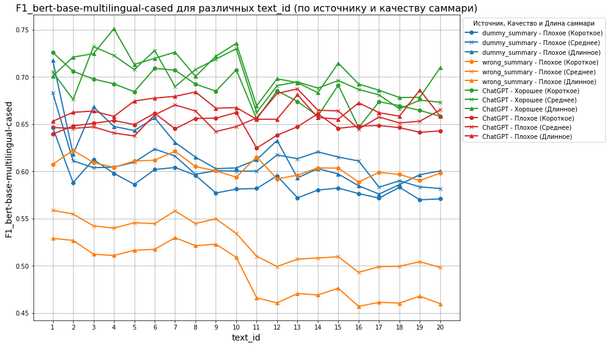
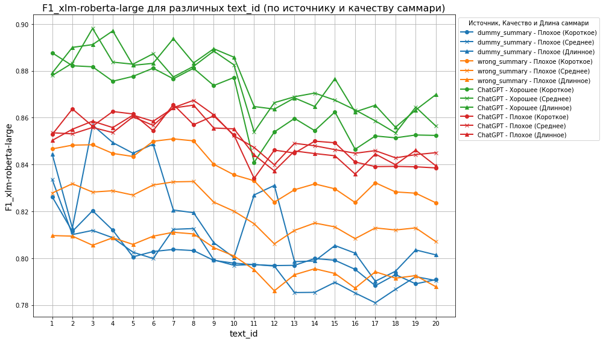
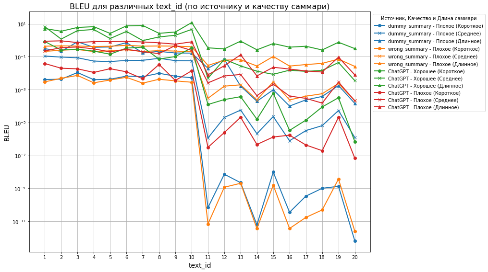
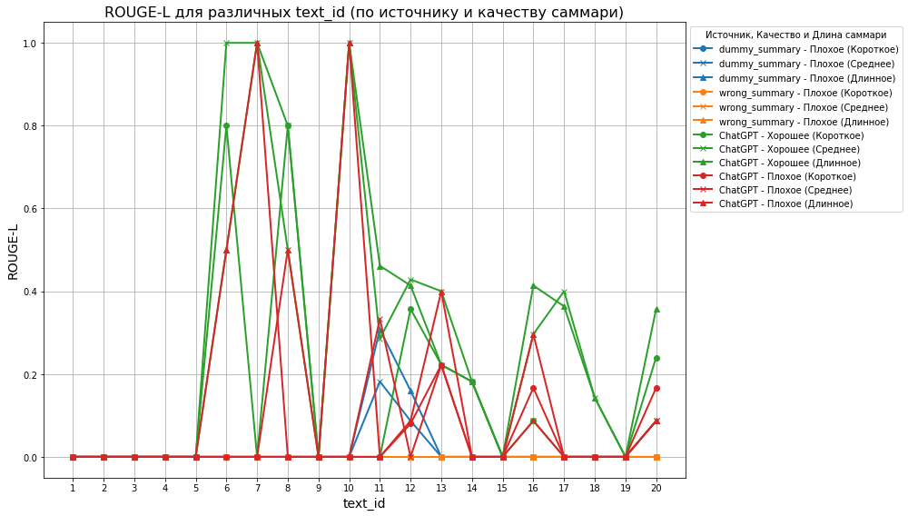
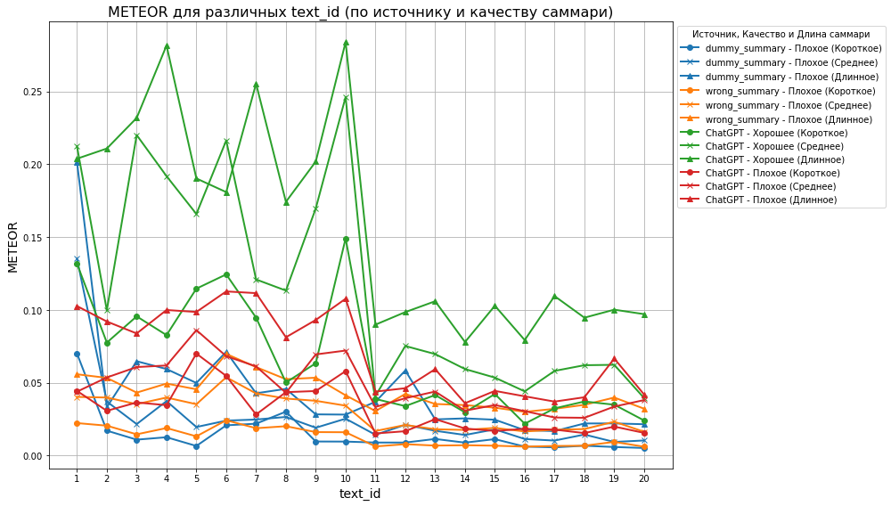
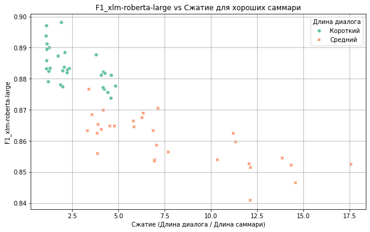

# Использование BERT-score для оценки качества саммари   
**Цель исследования:** проверка гипотезы, что BERT-score можно использовать в качестве метрики для определения качества саммари текста.   
# Данные   
## Исходные тексты   
Было создано 20 текстов, пародирующих диалог по рабочей тематике. Тексты отличаются по длине:
   
- 10 коротких диалогов (до 500 слов) - соответствует встрече длительностью до 5 минут.   
- 10 диалогов средней длины ( 500-2000 слов) - для встреч 5-20 минут.   
   
> Примечание: для более детального анализа также можно создать длинные тексты, соответствующие встречам более 20 минут (более 2000слов).   

## Саммари   
Для каждого текста было создано 4 типа саммари:   
1. **Хорошее** саммари - связный текст, отражающий основные мысли, возникшие в диалоге;   
2. **Плохое** саммари - связный текст, созданный на основе диалога, но отличающийся по смыслу;   
3. **dummy** summary - текст, в котором взято каждое k-e слово исходного диалога;   
4. **wrong** summary - связный текст, который создан на основе **другого** диалога, из-за чего не должен получить хорошие результаты по метрике.   
   
   
Для каждого из четырех типов сделаны саммари различной длины:   
- короткие - до 50 слов;   
- средней длины - 50-100 слов;   
- длинные - более 100 слов.   
   
В результирующем датасете итого 20\*4\*3=240 строк.   
# Используемые метрики для сравнения   
1. **BERT**   
    > BERT-score — это метрика, основанная на скрытых представлениях, полученных из трансформерной модели BERT (или её аналогов, таких как XLM-RoBERTa). В отличие от традиционных метрик, которые ориентируются на точность совпадений n-грамм (например, BLEU), BERT-score измеряет семантическую схожесть между текстом и саммари на основе векторных представлений слов, полученных через BERT. Для этого используется cosine similarity между эмбеддингами слов в двух текстах.   

    BERT-score учитывает как точность (precision), так и полноту (recall), и часто используется для оценки более сложных текстовых задач, таких как генерация саммари, где важна не только точность совпадений, но и способность модели улавливать смысл текста. Это позволяет использовать **BERT-score** для оценки качества саммари, несмотря на различия в словах и их порядке. В качестве итоговой метрики часто используется **F1**, который сбалансированно учитывает как precision, так и recall.   
    **Преимущества**:   
    - Позволяет учитывать семантическую схожесть, а не только точность совпадений.   
    - Хорошо работает с языками, где важна морфология и синонимия.   
   
    **Ограничения**:   
    - Требует больше вычислительных ресурсов, так как использует нейросети для получения эмбеддингов.   
    - Модели BERT не всегда идеально подходят для всех типов задач, особенно в случае с очень короткими текстами.   
   
    Метрика **BERT-score** была рассчитана на основе двух моделей:   
    - **bert-base-multilingual-cased**: это версия **BERT**, обученная на текстах из Википедии на 104 языках, включая русский. Эта модель достаточно универсальна и подходит для большинства задач обработки естественного языка.   
    - **xlm-roberta-large**: это более мощная мультиязычная версия модели RoBERTa, обученная на 100 языках. В отличие от `bert-base-multilingual-cased`, **XLM-RoBERTa** имеет более глубокую архитектуру (24 слоя вместо 12), что позволяет ей лучше улавливать сложные семантические зависимости в текстах, и в результате она дает более точные результаты, особенно для длинных и многозначных текстов. Однако эта модель требует больше вычислительных ресурсов.   
2. **BLEU**   
    > BLEU (Bilingual Evaluation Understudy) — это метрика, используемая для оценки качества машинного перевода, основанная на подсчете n-грамм.   

    Она измеряет, насколько n-граммы в саммари совпадают с эталонными текстами. Однако **BLEU** страдает от проблем, связанных с порядком слов и точностью, что особенно важно для языков с свободным порядком слов, как русский. Кроме того, **BLEU** не учитывает синонимы и морфологические изменения, что делает его менее чувствительным к вариативности текста.   
3. **ROUGE**   
    > ROUGE (Recall-Oriented Understudy for Gisting Evaluation) — это метрика, ориентированная на полноту, а не на точность.   

    Она измеряет количество n-грамм, которые совпадают с эталонными текстами, или длину самой длинной общей подпоследовательности (LCS). **ROUGE** используется для оценки качества саммари и часто используется в задачах, где важно полнота представления информации. **ROUGE** ориентирован на количество совпадений, и поэтому может не учитывать точность или важность слов, что делает его более подходящим для задач, где важна полнота, а не точность.   
4. **METEOR**   
    > METEOR (Metric for Evaluation of Translation with Explicit ORdering) — это метрика, которая оценивает совпадение слов в тексте с учетом их синонимов, морфологии и порядка.   

    **METEOR** имеет несколько преимуществ перед **BLEU**, поскольку учитывает синонимы и наказания за перестановку слов, что делает ее более чувствительной к смыслу текста. Однако, как и **ROUGE**, **METEOR** ориентирован на полноту, а не на точность. Она также использует стемминг и синонимы для оценки схожести между текстами, что может быть полезным для языков с богатой морфологией, таких как русский.   
   
## Теоретические предпосылки к результатам   
- **BLEU** может быть менее эффективен при оценке саммари, поскольку не учитывает синонимы и перестановки слов.   
- **ROUGE** хорошо подходит для оценки полноты саммари, но может не учитывать важность отдельных слов.   
- **METEOR** более чувствителен к смысловым аспектам текста, особенно с учетом синонимов и морфологии, что делает его полезным в задачах, где важна гибкость в выражении.   
   
# Методология   
Для BERT была выбрана метрика **F1**. Это связано с тем, что F1 обеспечивает сбалансированное внимание как к точности, так и к полноте, что важно для оценки саммари.   
# Эксперимент   
## BERT with `**bert-base-multilingual-cased**`   
    
## BERT with `**xlm-roberta-large**`   
    
## BLEU   
    
## ROUGE
   
    
## METEOR   
    
# Результаты   
1. Метрика **BERT** с моделью `xlm-roberta-large`  показала наилучшие результаты: хорошее саммари всегда имеет метрику больше, чем плохое (*если сравнивать однотипные саммари для одного текста*).   
2. Метрика **BLEU** показала хорошие результаты на всех тестах, однако в тексте 11 хорошее среднее и плохое среднее саммари имеют схожий score.   
3. Метрика **METEOR** показала сравнительно хорошие результаты:   
    - Для большинства текстов результаты ожидаемые;   
    - Хорошее длинное и плохое длинное саммари получили схожий score (текст 1);   
    - Хорошее среднее и плохое среднее саммари получили схожий score (текст 11);   
    - Хорошее короткое и плохое короткое саммари имеют схожий score (текст 16 и 20).   
4. Метрика **BERT** с моделью `bert-base-multilingual-cased` ошиблась в 2 текстах:   
    - Для большинства текстов саммари хорошего качества превосходит по метрике плохое саммари;   
    - Плохое длинное саммари получило score выше, чем хорошее длинное в текстах 1 и 19;   
    - Хорошее короткое и плохое короткое саммари имеют схожий score в текстах 14 и 16.   
5. Метрика **ROUGE** дала score 0 на многих хороших саммари.   
   
## Особенности   
1. Используя метрику BERT, короткое и длинное саммари проще различить по метрике (отличить хорошее от плохого), чем среднее;   
2. Все метрики уменьшаются с увеличением длины диалога (отрицательная корреляция). Поэтому необходимо сравнивать результаты для разных длин диалога по отдельности.   
        
3. Заметно снижение метрики с увеличением сжатия текста (отрицательная корреляция). Это связано с тем, что длинные саммари часто теряют точность, либо сами тексты слишком сложны для модели для корректного сжатия. Поэтому необходимо сравнивать результаты для разных длин саммари по отдельности.   
   
# Обсуждение   
- **METEOR** и **BLEU** — это метрики, которые фокусируются на точности и полноте, но они работают по-разному. **METEOR** более чувствительна к синонимам и морфологии, что может объяснять схожие результаты между хорошим и плохим саммари для определенных текстов.   
- **XLM-RoBERTa** дает лучшие результаты, чем **bert-base-multilingual-cased**, потому что модель была обучена на большем объеме данных и более сложной архитектуре, что позволяет ей лучше обрабатывать тексты на разных языках.   
   
# Выводы   
Итак, метрику BERT действительно можно использовать для определения качества саммари. Однако необходимо правильно выбрать модель, которая подойдет для конкретной задачи. Тем не менее, **BLEU** и **METEOR** могут быть полезными в качестве **дополнительных метрик** для оценки, особенно если важен акцент на точности или синонимах.
